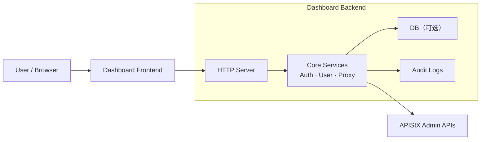

# 后端服务架构设计

apisix-dashboard-unofficial是一个用于apisix网关的前端管理面板，其包含一个前端服务和后端服务。前端服务用于提供对APISIX配置的可视化管理，后端服务负责请求转发和安全认证。

该后端服务需要做到极简，一定不要直接连接apisix对应的etcd，减少业务侵入，尽量与各个其他模块解耦。

主要提供以下能力：

- 基础能力：http请求转发
  - 将前端发起的http请求转发至对应apisix admin api
  - 转发可以设置多种方式，如随机转发，或只转发到其中一个host上
- 安全能力：认证鉴权、审计功能
  - 提供基于JWT的多用户认证功能，支持不同用户有不同权限
  - [待讨论]提供基于RBAC的权限控制功能
  - 所有操作可追溯、可审计

实现方式：

- 使用http-proxy-middleware进行请求转发
- 使用jsonwebtoken等库实现JWT认证鉴权
- 对每个请求赋request_id，并日志进行审计

系统流程图：

